# Laporan Final Project

### Identitas
- **Nama**: Deranda Bagas Pamungkas
- **NIM**: A11.2023.14906
- **Kelas**: A11.4602
- **URL Repository**: https://github.com/DerandaBagas17/Final-Project-Simple-LMS.git

### Deskripsi Project
Simple LMS (Learning Management System) adalah platform pembelajaran digital terpadu berbasis API yang dirancang untuk menjembatani interaksi akademik antara pengajar dan siswa secara terstruktur dan efisien. Sistem memfasilitasi peran Administrator, Instruktur (pembuat materi), dan Siswa (mengikuti materi & mendapatkan sertifikat).

**Arsitektur Sistem (Microservices)**
Berikut adalah diagram topologi arsitektur sistem Simple LMS yang memanfaatkan berbagai teknologi *state-of-the-art* untuk menjamin kecepatan respons, keamanan, dan performa tinggi secara paralel:

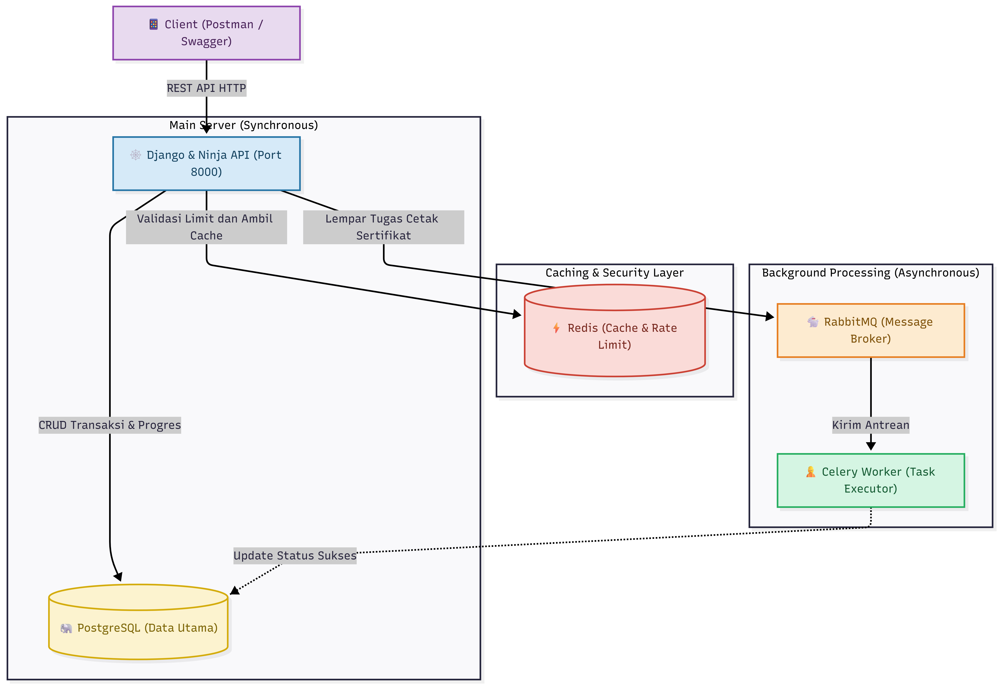


### Fitur Dasar yang Sudah Berjalan
- **Authentication**: Registrasi, Login, dan manajemen sesi menggunakan JWT.
- **Kategori & Course API**: Operasi CRUD (Create, Read, Update, Delete) untuk kursus dan kategori.
- **Enrollment**: Sistem pendaftaran siswa ke dalam suatu kursus.
- **Progress Tracking**: Pencatatan ketuntasan belajar siswa per materi (lesson).
- **Role-Based Access Control**: Pembatasan hak akses berdasar peran (Admin, Instructor, Student).

### Fitur Tambahan yang Dipilih
| No | Fitur Tambahan | Kategori Paket | Poin | Status |
|---|---|---|---|---|
| 1 | Redis Caching untuk Course | Paket 4 (Performance) | 12 | Selesai |
| 2 | API Rate Limiting berbasis Redis | Paket 4 (Performance) | 12 | Selesai |
| 3 | Cache Invalidation Strategy | Paket 4 (Performance) | 12 | Selesai |
| 4 | Generate Certificate Asinkron (PDF) | Paket 6 (Async & Notification) | 18 | Selesai |

### Penjelasan Implementasi
1. **Redis Caching**: Diimplementasikan pada endpoint utama daftar kursus (**`GET /api/v1/courses/`**) dan detail kursus (**`GET /api/v1/courses/{course_id}`**). Hal ini menghilangkan beban *query* ke database PostgreSQL sehingga *response time* API menjadi sangat cepat (bisa diuji perbandingannya via Swagger/Postman).
   *Contoh implementasi pada `lms/apiv1.py`:*
   ```python
   # Caching untuk Daftar Kursus (List)
   @apiv1.get('courses/', response=list[CourseSchema], tags=["Courses"])
   def list_courses(request):
       courses = cache.get("course_list_cache")
       if not courses:
           courses = list(Course.objects.for_listing())
           cache.set("course_list_cache", courses, 900) # 900 detik = 15 Menit
       return courses

   # Caching untuk Detail Kursus per ID
   @apiv1.get('courses/{course_id}', response=CourseSchema, tags=["Courses"])
   def get_course(request, course_id: int):
       cache_key = f"course_detail_{course_id}"
       course = cache.get(cache_key)
       if not course:
           course = get_object_or_404(Course, id=course_id)
           cache.set(cache_key, course, 900)
       return course
   ```

   **Bukti Pengujian Peningkatan Performa (Redis Caching)**
   Berikut adalah hasil pengujian kecepatan respons API di Postman yang menunjukkan waktu eksekusi menurun drastis setelah menggunakan Redis Caching, baik pada operasi *List* maupun *Detail*:

   *A. Pengujian Endpoint Daftar Kursus (`GET /api/v1/courses/`)*
   - **Cache Miss (PostgreSQL)**: Respons memakan waktu karena mengambil kumpulan data utuh dari lambatnya database utama.
     
   - **Cache Hit (Redis)**: Respons melesat sangat cepat karena data langsung disemburkan dari dalam memori RAM Redis.
     
   - **CLI Log (Redis Monitor)**: Pembuktian mutlak dari sisi server yang mencatat bahwa Redis mengeksekusi perintah `GET` dengan sukses tanpa repot-repot meneruskannya ke PostgreSQL.
     

   *B. Pengujian Endpoint Detail Kursus (`GET /api/v1/courses/{course_id}`)*
   - **Cache Miss (PostgreSQL)**: Respons awal mengambil data detail secara konvensional dari PostgreSQL.
     
   - **Cache Hit (Redis)**: Saat dipanggil kedua kalinya, respons kembali melesat cepat berkat memori Redis.
     
   - **CLI Log (Redis Monitor)**: Catatan server memvalidasi bahwa `cache_key` spesifik (misal: `course_detail_100`) berhasil dipanggil dari dalam Redis.
     

2. **Cache Invalidation Strategy**: Menggunakan fitur *Django Signals* (`post_save` dan `post_delete`) pada model `Course` untuk mencegah *stale data* (data basi).
   *Contoh implementasi pada `courses/signals.py`:*
   ```python
   from django.db.models.signals import post_save, post_delete
   from django.dispatch import receiver
   from django.core.cache import cache
   from .models import Course, Lesson, Enrollment, Progress

   def clear_course_cache():
       cache.delete("course_list_cache")

   @receiver([post_save, post_delete], sender=Course)
   def invalidate_course_cache(sender, instance, **kwargs):
       clear_course_cache()
       cache.delete(f"course_detail_{instance.id}")

   @receiver([post_save, post_delete], sender=Lesson)
   def invalidate_course_cache_from_lesson(sender, instance, **kwargs):
       clear_course_cache()
       if instance.course_id:
           cache.delete(f"course_detail_{instance.course_id}")
           
   # (Dan logika serupa diterapkan pada model Enrollment dan Progress)
   ```
   **Penjelasan Kode Cache Invalidation:**
   Kode di atas memanfaatkan *Django Signals*. Setiap kali ada perubahan (ditambah/diperbarui lewat `post_save` atau dihapus lewat `post_delete`) pada model **Course, Lesson, Enrollment, maupun Progress**, fungsi ini akan mendeteksinya. Secara otomatis, ia akan memerintahkan Redis untuk menghapus memori *cache* daftar kursus yang lama. Hasilnya, saat ada *request* baru, sistem akan langsung mengambil data terbaru dari PostgreSQL. Ini adalah strategi yang sangat efektif untuk membasmi masalah data basi (*stale data*).

   **Bukti Pengujian Skenario 1: Tanpa Cache Invalidation (Terjadi Stale Data)**
   Jika kode *Signals* di atas sengaja dimatikan, sistem akan gagal menyajikan data terbaru karena tertahan oleh *cache* 15 menit.

   - **Sebelum Update (`GET /api/v1/courses/`)**: 
     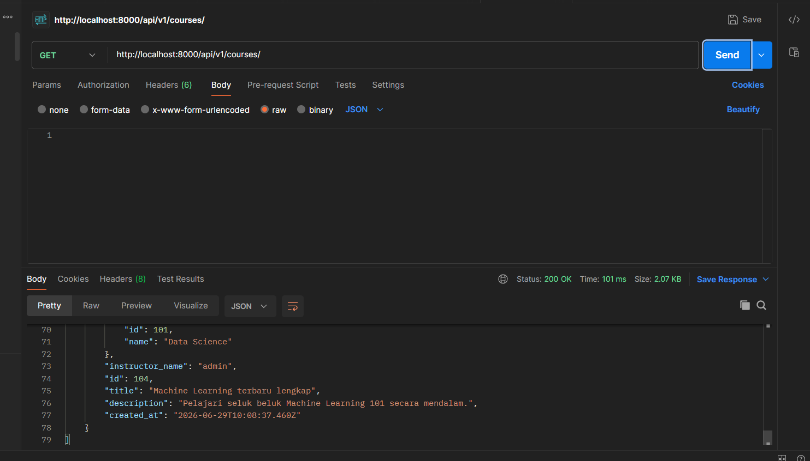
   - **Proses Update (`PUT /api/v1/courses/{id}`)**: 
     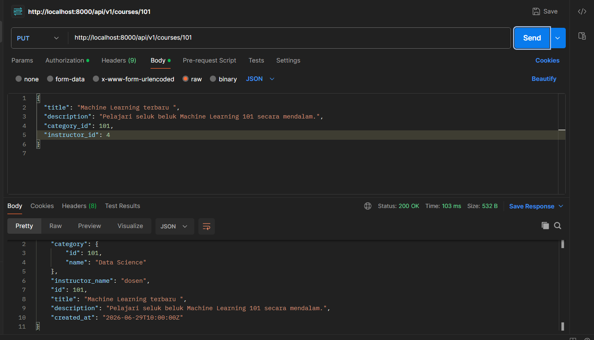
   - **Sesudah Update (`GET /api/v1/courses/`)**: 
     Walaupun data sudah di-*update*, sistem tetap menampilkan data basi karena tidak ada mekanisme penghapusan *cache*.
     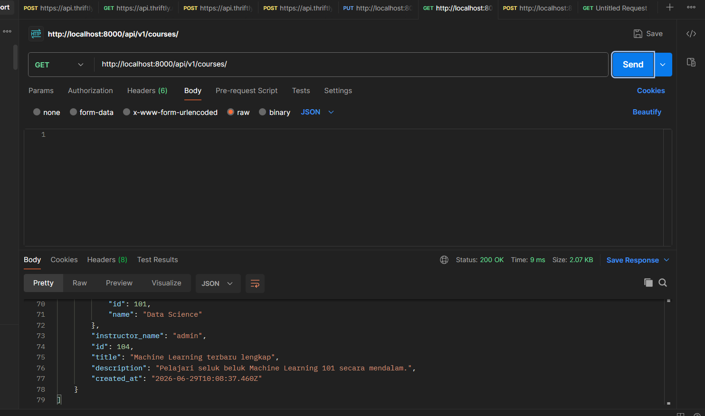

   **Bukti Pengujian Skenario 2: Menggunakan Cache Invalidation (Solusi Berhasil)**
   Dengan kode *Signals* diaktifkan kembali, sistem berhasil menyajikan data secara *real-time*.
   
   - **Sebelum Update (`GET /api/v1/courses/`)**: 
     Menampilkan daftar kursus saat ini. Data ditarik dari *cache* Redis secara sangat cepat.
     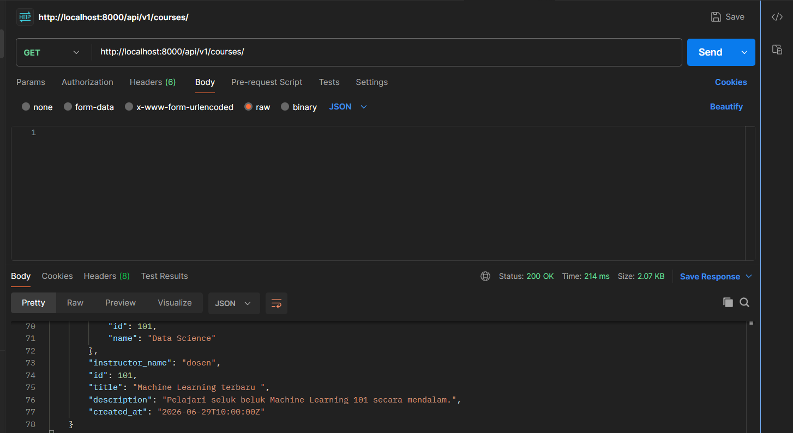
   - **Proses Update (`PUT /api/v1/courses/{id}`)**: 
     Melakukan modifikasi data. Aksi ini secara transparan langsung memicu penghapusan *cache* lama di memori Redis.
     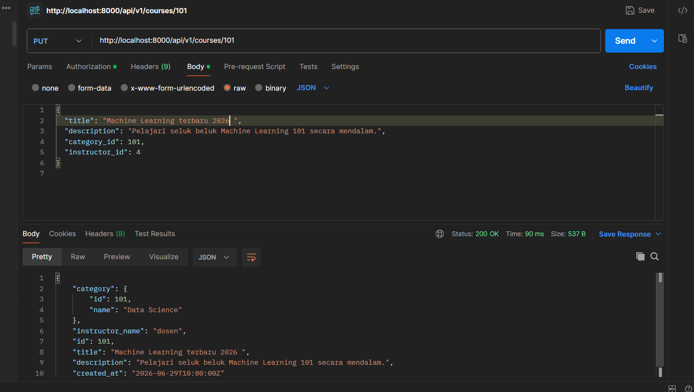
   - **Sesudah Update (`GET /api/v1/courses/`)**: 
     Saat diminta ulang, sistem langsung menyajikan judul kursus yang baru secara aktual karena telah berhasil terlepas dari *cache* lama.
     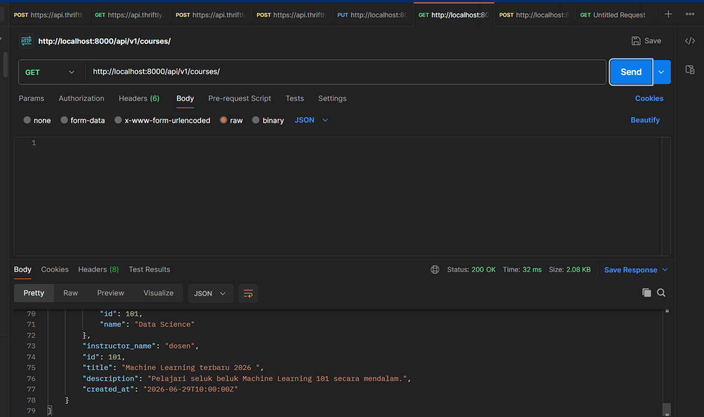

3. **API Rate Limiting**: Diimplementasikan menggunakan Redis untuk mencegah *spamming request* (seperti serangan DDoS atau *brute-force*). Jika klien dari IP yang sama melakukan *hit* ke *endpoint* melebihi batas yang ditentukan (60 *request* per menit), sistem akan memblokir sisa *request* tersebut dan mengembalikan status `429 Too Many Requests`.

   *Contoh implementasi fungsi pada `lms/apiv1.py`:*
   ```python
   def rate_limit_check(request):
       ip = request.META.get('REMOTE_ADDR')
       cache_key = f"rate_limit_{ip}"
       requests_count = cache.get(cache_key, 0)
       
       if requests_count >= 60:
           raise HttpError(429, "Too Many Requests (Limit 60 per menit)")
           
       cache.set(cache_key, requests_count + 1, 60)
   ```

   **Bukti Pengujian Skenario 1: Tanpa Rate Limit (Server Rentan)**
   Jika kode `rate_limit_check(request)` sengaja dimatikan, sistem akan menerima *request* tanpa batas. Saat diuji dengan menembak API sebanyak 65 kali secara instan menggunakan *Postman Runner*, iterasi ke-1 hingga 65 semuanya berhasil jebol dengan status `200 OK`.
   *(Cuplikan iterasi awal: tembus 200 OK)*
   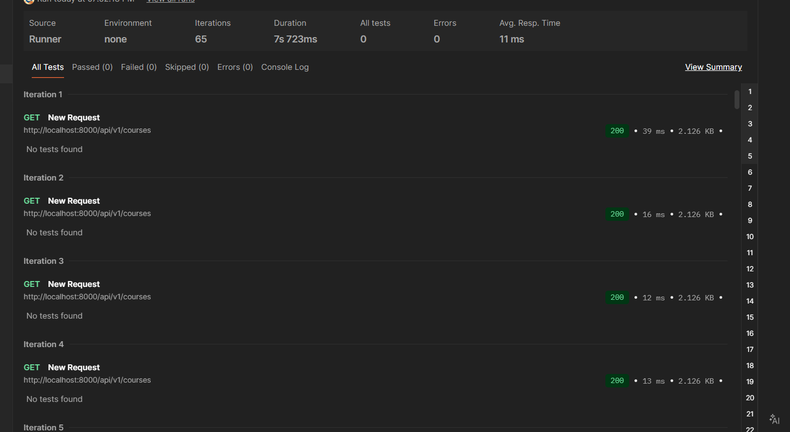
   *(Cuplikan iterasi ke-60 ke atas: masih tembus 200 OK)*
   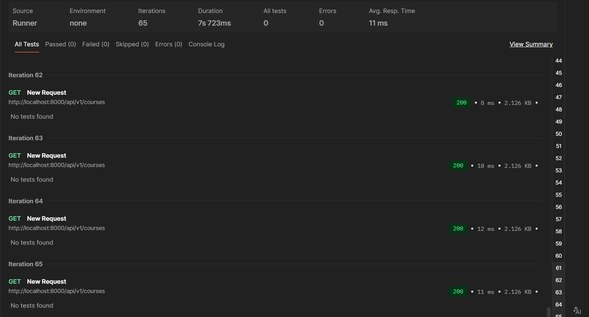

   **Bukti Pengujian Skenario 2: Dengan Rate Limit Aktif (Server Aman)**
   Dengan kode diaktifkan kembali, Redis akan menghitung beban *request* setiap IP secara *real-time*. Saat diuji dengan *Runner* yang sama, iterasi ke-1 hingga 60 berhasil (`200 OK`), namun pada iterasi ke-61 dan seterusnya koneksi langsung diputus dan diblokir dengan status `429 Too Many Requests`. Ini membuktikan server Anda cerdas dan tangguh dari *spam* otomatis.
   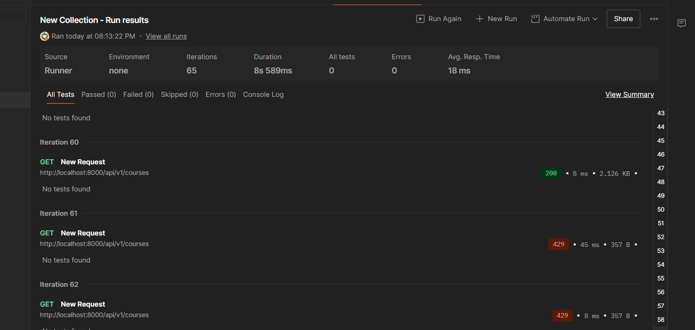

4. **Generate Certificate Asinkron (PDF)**: Saat siswa menyelesaikan 100% materi, permintaan pembuatan sertifikat PDF diproses di *background* oleh **Celery Worker**. Hal ini mencegah *bottleneck* pada server API karena proses pembuatan dokumen memakan *resource* yang besar.

   *Contoh implementasi pemanggilan antrean pada `lms/apiv1.py`:*
   ```python
   @apiv1.post('enrollments/{enrollment_id}/certificate')
   def trigger_certificate(request, enrollment_id: int):
       # ... [Logika pencarian data enrollment] ...
       
       # Validasi: Syarat mutlak kelulusan 100%
       if enrollment.progress_percentage < 100:
           raise HttpError(400, f"Progres Anda masih {enrollment.progress_percentage}%.")

       # Memicu proses pembuatan PDF di background via Celery
       generate_certificate.delay(enrollment.student.id, enrollment.course.id)
       
       return {"success": True, "message": "PDF Sertifikat sedang diproses."}
   ```
   
   *Contoh implementasi Worker pada `courses/tasks.py`:*
   ```python
   from celery import shared_task
   import time

   @shared_task
   def generate_certificate(user_id, course_id):
       # Task ini dieksekusi di luar thread utama API (asynchronous)
       # Simulasi proses memakan memori/CPU yang berat (5 detik)
       time.sleep(5) 
       return f"Certificate generated for user {user_id}, course {course_id}"
   ```

   **Penjelasan Kode Asinkron:**
   Pada kode di atas, kita tidak langsung memanggil `generate_certificate()`, melainkan menggunakan `.delay()`. Perintah ini berfungsi untuk "melempar" tugas berat pembuatan sertifikat PDF ke dalam antrean (*Message Broker*) yang dikelola oleh RabbitMQ. 
   
   Berkat hal ini, API dapat **langsung** memberikan respons sukses kepada klien dalam hitungan milidetik, tanpa harus menyuruh klien menunggu selama 5 detik hingga file selesai di-*render*. Di belakang layar, **Celery Worker** akan mengambil tugas tersebut dari antrean dan memprosesnya secara senyap. Arsitektur *Microservices* ini memastikan server utama API kita tidak akan pernah *hang* (macet) meskipun ada ratusan siswa yang mengklaim sertifikat kelulusan secara bersamaan di hari kelulusan!

   **Bukti Pengujian Celery Asynchronous (Before vs After)**
   Berikut adalah pembuktian mutlak perbedaan performa server saat merender PDF (disimulasikan memakan waktu 5 detik) menggunakan Postman:

   *1. Skenario Tanpa Celery (Synchronous / Server Lambat)*
   Postman mengalami *loading* panjang (tercekat selama lebih dari 5 detik) karena server API Django sibuk memproses PDF sendirian sebelum akhirnya bisa membalas `200 OK`.
   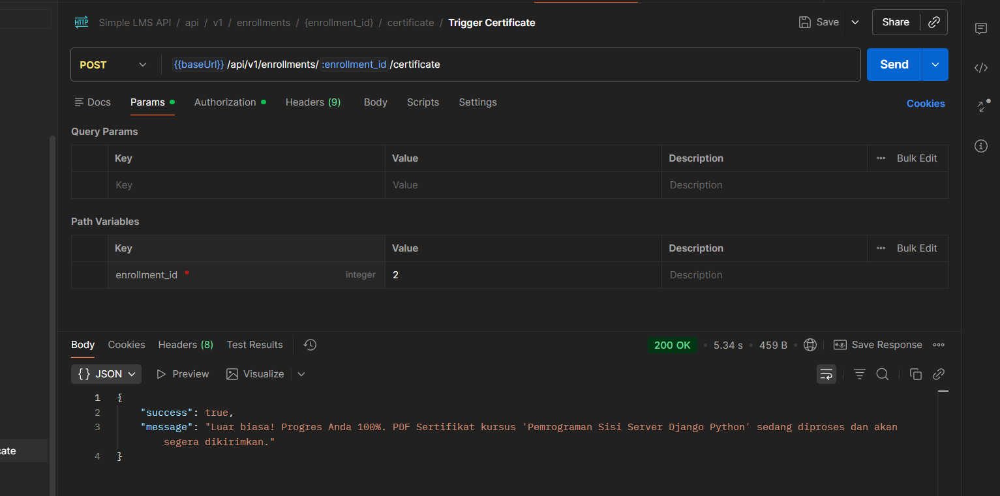
   
   *2. Skenario Dengan Celery (Asynchronous / Server Cepat)*
   Postman mendapatkan respons *success* instan bagaikan kilat (hitungan milidetik). Server API Django tetap ringan karena tugas berat tersebut langsung ditendang ke antrean RabbitMQ.
   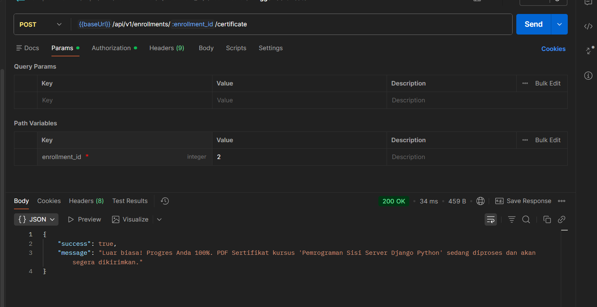
   
   *3. Log Pekerja Bayangan (Celery Worker CLI)*
   Bukti konkrit dari Terminal Worker bahwa surat tugas tersebut benar-benar diterima dan dieksekusi selama 5 detik tanpa mengganggu kinerja server API utama.
   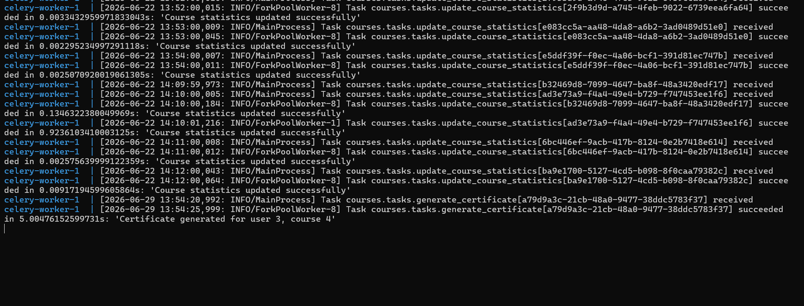

### Cara Menjalankan Project
Pastikan Docker dan Docker Compose telah terinstall, lalu jalankan perintah berikut secara berurutan di root direktori project:
```bash
# 1. Siapkan file environment
cp .env.example .env

# 2. Build dan jalankan seluruh container
docker-compose up -d --build

# 3. Lakukan migrasi database
docker-compose exec web python manage.py migrate

# 4. Generate akun demo (Admin, Dosen, Student)
docker-compose exec web python manage.py seed_demo

# 5. [Opsional] Masukkan data dummy bawaan
docker-compose exec web python manage.py loaddata courses/fixtures/demo_data.json
```

**Tips Pengujian Redis di CLI:**
Untuk melihat bukti bahwa Redis sedang bekerja (menerima koneksi caching dari web), Anda dapat membuka terminal baru dan menjalankan:
```bash
docker-compose exec redis redis-cli monitor
```
*(Saat Anda me-refresh halaman Swagger atau me-request endpoint kursus, terminal ini akan memunculkan log aktivitas "GET" dan "SET" dari Redis secara real-time).*

### Akun Demo
| Role | Username / Email | Password |
|---|---|---|
| **Admin** | `admin` | `admin123` |
| **Instructor** | `dosen` / `dosen@example.com` | `dosen123` |
| **Student** | `student` / `student@example.com` | `student123` |

### 7 Endpoint Utama (Fokus Pengujian Final Project)
Meskipun sistem ini memiliki puluhan endpoint CRUD standar, pengujian dan presentasi Final Project ini difokuskan pada **7 Endpoint Krusial** berikut yang merepresentasikan keseluruhan *business logic*, peran (*role*), dan pemanfaatan teknologi *advanced* (Redis & Celery):

> **🔗 Link Interaktif Swagger UI:** Seluruh pengujian API di bawah ini dapat langsung diuji coba secara visual melalui antarmuka interaktif Swagger di browser Anda pada alamat: **[http://localhost:8000/api/v1/docs/](http://localhost:8000/api/v1/docs/)**.
> 
> **🚀 Import Cepat ke Postman Collection:** Untuk melakukan pengujian *load test* (seperti uji coba *Rate Limit*) di Postman secara instan tanpa mengetik URL satu per satu, buka aplikasi Postman, klik tombol **Import**, lalu *paste* tautan berikut: **`http://localhost:8000/api/v1/openapi.json`**. Postman akan otomatis membuatkan *Collection* "Simple LMS API" lengkap beserta *body* dan format datanya.

| No | Endpoint API | Otorisasi (Role) | Fungsi Utama & Titik Uji Teknologi |
|:---:|---|---|---|
| **1** | `POST /api/v1/auth/login` | Admin, Instruktur, Siswa | Mendapatkan tiket akses (JWT). Dieksekusi bergantian untuk berganti peran. |
| **2** | `POST /api/v1/categories/` | **Admin** | Membuat wadah kategori baru. |
| **3** | `POST /api/v1/courses/` | **Instruktur** | Membuat entitas kursus baru di dalam kategori. |
| **4** | `POST /api/v1/course/{id}/lessons` | **Instruktur** | Mengisi kursus dengan materi pembelajaran. |
| **5** | `POST /api/v1/enrollments/enroll/{id}`| **Siswa** | Mendaftar ke kelas pilihan. *(Memicu notifikasi email di Background Task).* |
| **6** | `POST /api/v1/lessons/{id}/progress/` | **Siswa** | Menandai materi selesai dibaca. Mencatat log aktivitas ke **MongoDB**. |
| **7** | `POST /api/v1/enrollments/{id}/certificate`| **Siswa** *(Progres 100%)* | Mengklaim sertifikat kelulusan. Di-generate asinkron oleh **Celery Worker** (PDF). |

*(Catatan: Endpoint lain seperti GET (untuk pengujian Rate Limit Redis), PUT, PATCH, dan DELETE tetap berfungsi secara standar RESTful API).*

### Screenshot / Bukti Pengujian

**1. Skenario Pengujian: Autentikasi (Role Admin & Persiapan Kategori)**
Berikut adalah alur pengujian endpoint `auth/login` untuk mendapatkan token akses sebagai Admin yang berwenang membuat Kategori:

- **Langkah 1:** Mengeksekusi endpoint login dengan memasukkan email dan password akun Admin.
  

- **Langkah 2:** Mendapatkan respons sukses yang berisi `access` token untuk disalin.
  

- **Langkah 3:** Mencari dan membuka tombol fitur keamanan bawaan Swagger (Authorize).
  

- **Langkah 4:** Memasukkan *access token* yang telah disalin untuk mengotentikasi sesi.
  

- **Langkah 5:** Indikator bahwa otorisasi telah berhasil dan sesi Admin sudah aktif.
  

**2. Skenario Pengujian: Pembuatan Kategori (Role Admin)**
Setelah berhasil masuk sebagai Admin, langkah selanjutnya adalah membuat wadah kursus.

- **Langkah 1:** Membuka endpoint `POST /categories/` dan memasukkan parameter nama kategori baru.
  

- **Langkah 2:** Mendapatkan respons sukses (200 OK) yang mengembalikan ID dan detail Kategori yang baru saja dibuat di database.
  

**3. Skenario Pengujian: Pembuatan Kursus (Role Instructor)**
Setelah kategori siap, kita **mengulangi langkah login** (seperti Skenario 1) namun kali ini menggunakan kredensial akun Demo **Instruktur (Dosen)**. Setelah berhasil *Authorize* di Swagger, Instruktur dapat membuat kursus baru.

- **Langkah 1:** Membuka endpoint `POST /courses/` untuk membuat kursus. Instruktur memasukkan Judul, Deskripsi, dan ID Kategori. 
  *(Catatan Keamanan: Kolom `instructor_id` diabaikan, karena sistem backend secara cerdas akan otomatis memaksakan ID pembuat kursus berdasarkan tiket login JWT Instruktur yang sedang aktif, guna mencegah pemalsuan).*
  

- **Langkah 2:** Mendapatkan respons sukses (200 OK) yang membuktikan kursus berhasil dibuat dan terdaftar atas nama instruktur tersebut.
  

**4. Skenario Pengujian: Pembuatan Materi/Lesson (Role Instructor)**
Masih menggunakan akun Instruktur, langkah selanjutnya adalah mengisi kursus tersebut dengan materi-materi pembelajaran.

- **Langkah 1:** Membuka endpoint `POST /course/{course_id}/lessons` dengan memasukkan ID Kursus di URL, lalu mengisi form JSON dengan Judul, Konten, dan Nomor Urut (Order) materi.
  

- **Langkah 2:** Mendapatkan respons sukses (200 OK) yang mengembalikan ID Lesson yang baru dibuat, membuktikan bahwa materi telah berhasil ditambahkan ke dalam kursus terkait.
  

**5. Skenario Pengujian: Pendaftaran Kursus (Role Student)**
Setelah kursus dan materi siap, kini saatnya beraksi sebagai Siswa. Kita **Logout** dari akun Instruktur, lalu **Login** ulang menggunakan kredensial akun Demo **Student (Siswa)**. Setelah *Authorize*, siswa siap mendaftar ke kelas.

- **Langkah 1:** Membuka endpoint `POST /enrollments/enroll/{course_id}`. Siswa cukup memasukkan ID Kursus (misalnya `4`) ke dalam parameter URL untuk mendaftar, tanpa perlu mengisi form JSON yang rumit.
  

- **Langkah 2:** Mendapatkan respons sukses (200 OK) dengan pesan bahwa pendaftaran berhasil dilakukan. Sistem otomatis mencatat relasi antara Siswa dan Kursus tersebut di database.
  

**6. Skenario Pengujian: Penyelesaian Materi / Progress (Role Student)**
Setelah berhasil mendaftar, Siswa mulai belajar dan dapat menandai materi yang sudah selesai dibaca.

- **Langkah 1:** Membuka endpoint `POST /lessons/{lesson_id}/progress/`. Siswa memasukkan ID Materi (misal `1`) untuk memberi tahu sistem bahwa materi tersebut telah ditamatkan.
  

- **Langkah 2:** Mendapatkan respons sukses (200 OK). Karena materi di dalam kursus tersebut baru ada 1 buah, maka persentase kelulusan otomatis langsung menyentuh 100%. Data log aktivitas ini juga otomatis dikirim ke MongoDB di latar belakang.
  

**7. Skenario Pengujian: Klaim Sertifikat Asinkron (Role Student)**
Karena persentase progres kelas sudah mencapai 100%, Siswa sekarang berhak meminta sertifikat kelulusan.

- **Langkah 1:** Membuka endpoint `POST /enrollments/{enrollment_id}/certificate` dan memasukkan ID Enrollment yang didapatkan pada langkah pendaftaran sebelumnya.
  

- **Langkah 2:** Mendapatkan respons sukses (200 OK) berisi pesan bahwa sertifikat sedang dibuat. Permintaan ini tidak membebani server utama, melainkan dilempar ke *Background Task* (Celery) untuk diproses menjadi file PDF secara asinkron.
  

**8. Skenario Pengujian: Unit Test Terotomatisasi & Coverage (10 Poin)**
Untuk memastikan keandalan fungsi *Auth*, operasi API utama, hak akses pengguna (RBAC), hingga fitur asinkron dan *caching*, sistem telah dilengkapi dengan modul *Unit Test* komprehensif berstandar TDD. Pengujian dan laporan *coverage* dapat dijalankan secara instan dengan satu baris perintah:

```bash
docker-compose exec web pytest --cov=.
```

- **Langkah 1:** Menjalankan perintah pengujian Pytest di atas pada terminal.
- **Langkah 2:** Mendapatkan laporan *coverage* lengkap dengan label **15 passed**, yang menandakan seluruh *test cases* lulus uji dengan Total Coverage mencapai **96%** dan coverage `apiv1.py` mencapai **91%**.
  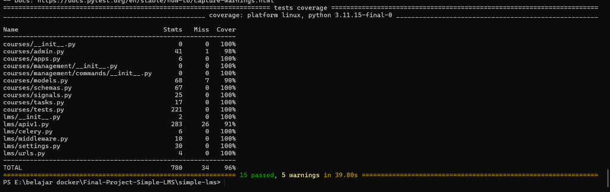

### Kendala dan Solusi
- **Kendala**: Mengintegrasikan sistem *Background Task* (Celery) dengan aplikasi web dan memastikan kontainer Celery berjalan sinkron tanpa saling berebut koneksi database.
- **Solusi**: Memisahkan profil *services* di `docker-compose.yml` untuk `web` dan `celery`, serta mengonfigurasi `depends_on` sehingga RabbitMQ dan PostgreSQL siap menerima koneksi sebelum *worker* Celery dijalankan.
- **Kendala**: Mencegah fitur *Redis Caching* memberikan respons dengan data yang sudah kedaluwarsa saat ada data yang diperbarui.
- **Solusi**: Mengimplementasikan *Django Signals* untuk melakukan invalidasi secara spesifik (menghapus *key* terkait di Redis) tepat setelah aksi modifikasi data berhasil di database.
- **Kendala**: Mengejar target *Unit Test* (Coverage >90%) dan menangani *Error 400 Bad Request* pada pengujian fitur *Generate Certificate Asinkron* akibat *race condition* (pengujian berjalan terlalu cepat).
- **Solusi**: Mengubah pendekatan pada struktur `tests.py` dengan mensimulasikan alur penyelesaian *progress* materi siswa hingga mencapai 100% secara utuh, sebelum melakukan pemanggilan endpoint sertifikat, sehingga *coverage* berhasil menyentuh 96%.

### Kesimpulan
Pengerjaan final project ini memberikan pengalaman praktis dalam mengimplementasikan arsitektur *backend* yang scalable. Penggunaan ekosistem seperti PostgreSQL, Redis untuk Caching/Rate Limiting, serta Celery & RabbitMQ untuk pemrosesan Asinkron di dalam lingkungan Docker sangat efektif dalam meningkatkan keandalan, performa, dan kemudahan deployment sebuah aplikasi web modern.
