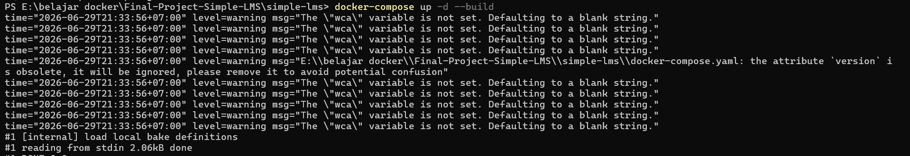
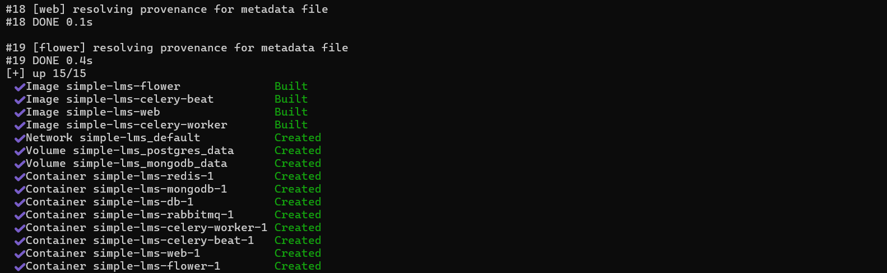
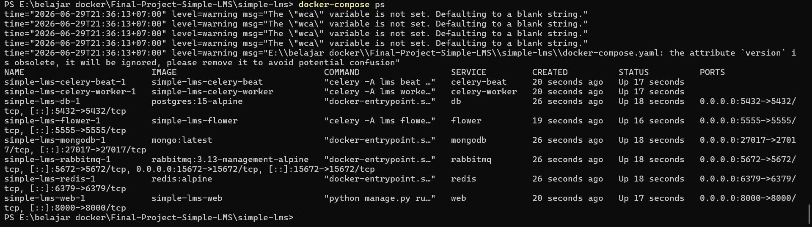

# Simple LMS - Platform Pembelajaran Interaktif

Simple LMS (Learning Management System) adalah platform pembelajaran digital terpadu yang dirancang untuk menjembatani interaksi akademik antara pengajar dan siswa secara terstruktur dan efisien. 

Sistem ini memfasilitasi tiga peran utama:
- **Administrator** sebagai pemegang kendali utama untuk mengatur kategori pembelajaran (seperti Fakultas atau Program Studi) dan mengelola akun pengguna.
- **Instructor (Pengajar/Dosen)** yang dapat dengan mudah membuat kursus (Course), menyusun modul pembelajaran (Lesson) secara berurutan, serta memantau perkembangan siswa.
- **Student (Siswa/Mahasiswa)** yang memiliki kebebasan untuk mengeksplorasi kursus, mendaftar ke kelas yang diminati (Enrollment), mengikuti materi secara bertahap, mencatat ketuntasan belajar (Progress), hingga pada akhirnya berhak mencetak sertifikat kelulusan.

Melalui arsitektur sistem yang dioptimalkan dengan proses asinkron dan analitik data, Simple LMS memastikan pengalaman belajar yang cepat, responsif, dan terdokumentasi dengan baik.

## 1. Cara Menjalankan Project

Ikuti langkah-langkah di bawah ini untuk menyalakan keseluruhan sistem di komputer/server Anda:

1. **Konfigurasi Environment**
   Salin file konfigurasi *dummy* menjadi file konfigurasi rahasia Anda. Di dalam terminal, jalankan (atau copy-paste secara manual file `.env.example` lalu ubah namanya menjadi `.env`):
   ```bash
   cp .env.example .env
   ```
2. **Membangun dan Menjalankan Sistem**
   Jalankan kontainer Docker untuk menyalakan Simple LMS:
   
   
   
   ```bash
   docker-compose up -d --build
   ```
   
   
   
   *Catatan: Jika terminal Anda menampilkan output dengan tulisan `Started` atau `Created` berwarna hijau, itu artinya seluruh kontainer Docker Anda telah berhasil dibangun dan berjalan normal di latar belakang.*

3. **Memeriksa Status Kontainer**
   Untuk memastikan bahwa semua *service* benar-benar berstatus menyala (`Up`), jalankan perintah berikut:
   ```bash
   docker-compose ps
   ```
   
   
   
   *Catatan: Pastikan semua kontainer (seperti web, db, redis, celery) memiliki status `Up` dan tidak ada yang `Exit`.*
4. **Membangun Tabel Database (Migration)**
   Setelah semua kontainer berstatus `running`, bangun tabel-tabel di dalam database PostgreSQL menggunakan file migrasi yang sudah tersedia dengan perintah:
   
   ```bash
   docker-compose exec web python manage.py migrate
   ```
   
   *Catatan: Jika terminal Anda dipenuhi oleh teks hijau bertuliskan `Applying... OK`, itu menandakan bahwa semua tabel dan struktur relasi database Anda telah berhasil di-install ke dalam kontainer PostgreSQL dengan sempurna.*

5. **Generate Akun Demo (Seeding)**
   Jalankan skrip *seeder* di bawah ini untuk membuat akun Admin, Instruktur, dan Siswa secara otomatis sehingga Anda bisa langsung menguji sistem tanpa perlu repot mendaftar:
   
   ```bash
   docker-compose exec web python manage.py seed_demo
   ```
   
   *Catatan: Script ini menggunakan `create_superuser` untuk otomatis mengenkripsi password Anda (hashing PBKDF2) agar terjamin keamanannya.*

6. **Memuat Data Kursus Awal (Fixtures)**
   Untuk mempermudah pengujian pendaftaran (*Enrollment*), Anda dapat memuat kumpulan data percontohan berupa Kategori, Kursus, dan Materi (Lessons) sekaligus ke dalam database tanpa perlu membuatnya satu per satu secara manual.
   
   ```bash
   docker-compose exec web python manage.py loaddata courses/fixtures/demo_data.json
   ```
   
   *Catatan: Jika Anda melihat pesan `Installed 5 object(s)`, itu berarti seluruh data telah sukses terpasang.*

## 2. Akun Demo (Testing)

Setelah Anda menjalankan perintah `seed_demo` di atas, gunakan daftar akun di bawah ini untuk mencoba *login* ke dalam sistem. Anda tidak perlu melakukan registrasi lagi.

| Role | Username / Email | Password | Keterangan / Hak Akses |
|---|---|---|---|
| **Admin** | `admin` | `admin123` | Dapat mengelola Kategori, Course, pengguna, dan pengaturan sistem. |
| **Instructor** | `dosen` | `dosen123` | Bertugas membuat Course, menyusun materi (Lesson), dan memantau siswa. |
| **Instructor 2**| `dosen1` | `dosen123` | Akun dosen tambahan untuk menguji simulasi keamanan lintas-akses. |
| **Student** | `student` | `student123` | Mendaftar (Enroll) ke kursus, mencetak sertifikat, dan menandai penyelesaian materi. |

### Catatan Pengujian (Final Project Report)
Untuk melihat secara lengkap bukti-bukti pengujian (*testing*), demonstrasi keamanan Hak Akses (403 Forbidden), serta unjuk kerja fitur tingkat lanjut seperti **Redis Caching**, **Redis Rate Limiting**, dan **Celery Asynchronous Tasks**, silakan merujuk pada dokumen laporan terpisah:
👉 **[FINAL_PROJECT_REPORT.md](./FINAL_PROJECT_REPORT.md)**

## 3. Endpoint Utama & Dokumentasi API

Aplikasi ini menggunakan **Swagger UI** untuk memberikan visualisasi dokumentasi endpoint secara interaktif (OpenAPI). 
Setelah server berjalan, dokumentasi bisa langsung dibuka dan diuji coba melalui *browser* di URL berikut:

👉 **[http://localhost:8000/api/v1/docs/](http://localhost:8000/api/v1/docs/)**

Atau Anda juga dapat mengimpor seluruh *collection* API secara otomatis ke dalam **Postman** menggunakan URL peta OpenAPI berikut:
👉 **[http://localhost:8000/api/v1/openapi.json](http://localhost:8000/api/v1/openapi.json)**

Berikut adalah beberapa modul endpoint utama yang tersedia:

- **Authentication (`/api/v1/auth/`)**: 
  Digunakan untuk *Register*, *Login*, dan mendapatkan Access Token (JWT). *(Gunakan akun demo di atas untuk login)*.
- **Categories (`/api/v1/categories/`)**: 
  Pengelolaan kategori kursus. Dilengkapi proteksi ketat (Hanya role `admin` yang diizinkan untuk mengubah data).
- **Courses (`/api/v1/courses/`)**: 
  Operasi CRUD untuk kursus. Dilengkapi dengan optimasi performa **Redis Caching** untuk menjamin respons yang sangat cepat.
- **Lessons (`/api/v1/course/{id}/lessons/`)**: 
  Manajemen struktur materi berurutan dalam sebuah kursus (Hanya pemilik/instruktur kursus yang berhak memodifikasi).
- **Enrollments (`/api/v1/enrollments/`)**: 
  Sistem pendaftaran kelas oleh siswa. Melibatkan **Celery Background Tasks** yang akan mengirimkan email notifikasi secara asinkron saat siswa berhasil mendaftar.
- **Progress (`/api/v1/lessons/{id}/progress/`)**: 
  Pencatatan ketuntasan belajar. Setiap aktivitas klik materi ini akan disimpan (Activity Logging) ke dalam **MongoDB**.
- **Analytics & Report (`/api/v1/analytics/`)**: 
  Endpoint pelaporan. Berisi *Pipeline Aggregation* MongoDB dan fitur *Export CSV* yang ditangani oleh **Celery Worker**.

---
*Dikembangkan menggunakan Django 5.x, Django Ninja, PostgreSQL, Redis, RabbitMQ, Celery, dan MongoDB.*
